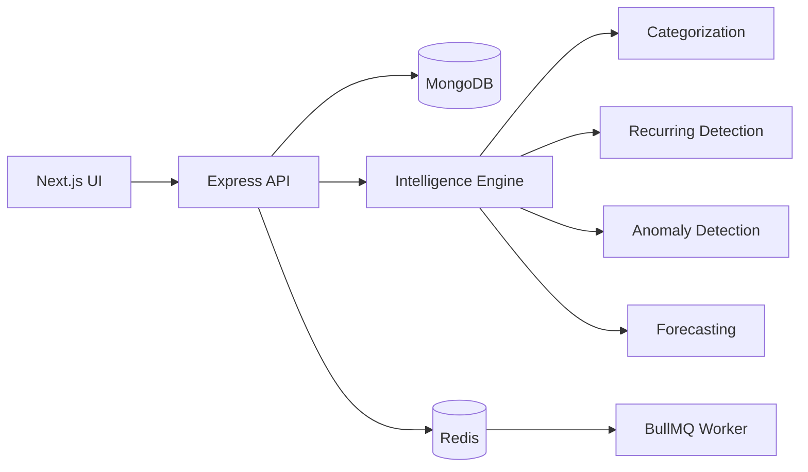

# FinSight

**Personal Finance Intelligence Platform** — a MERN/TypeScript portfolio project built around deterministic financial analytics rather than paid AI APIs.

## Stack
- Next.js + TypeScript + Tailwind CSS
- Express + TypeScript
- MongoDB + Mongoose
- Redis + BullMQ (background processing infrastructure)
- Framer Motion + Recharts

## Features
- JWT authentication with HTTP-only cookies
- Transactions with search/filter/sort/pagination-ready API
- Rule-based merchant normalization and categorization
- Budgets and subscription detection
- Z-score/IQR anomaly detection
- Moving-average forecasting
- Deterministic finance assistant
- What-if savings simulator
- CSV import endpoint
- Demo mode for immediate UI exploration
- Light/dark mode, responsive navigation, reduced-motion support
- Docker Compose for MongoDB, Redis, backend and frontend

## Local setup
1. Copy `.env.example` to `backend/.env` and set `JWT_SECRET`.
2. Install dependencies:
   `npm run setup`
3. Start MongoDB/Redis locally or run `docker compose up -d mongodb redis`.
4. Run `npm run dev`.
5. Frontend: http://localhost:3000
6. Backend: http://localhost:5000

## Docker
`docker compose up --build`

## Demo
The dashboard has a **Load Demo Data** action. Demo data is synthetic and generated by the backend.

## Architecture

## Important
FinSight is a portfolio/education application, not financial advice. Forecasts are estimates and anomaly detection does not identify fraud.
